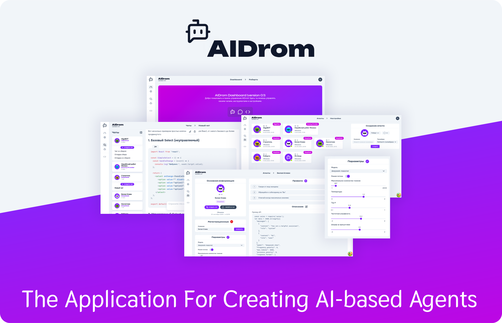
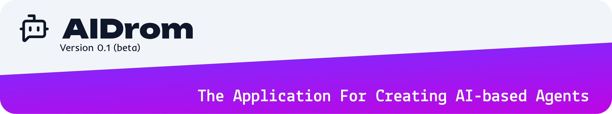

<div align="center">

# AIDrom

**Платформа для тестирования и интеграции AI моделей через единый интерфейс LLM провайдеров**

[](https://opensource.org/licenses/MIT)
[](https://www.docker.com/)
[](https://nodejs.org/)
[](https://reactjs.org/)
[](https://www.typescriptlang.org/)

#### Frontend performance

[](docs/PERFORMANCE.md)
[](docs/PERFORMANCE.md)
[](docs/PERFORMANCE.md)

</div>

## Описание проекта

**AIDrom** — система для работы с AI моделями, обеспечивающая единый интерфейс для различных LLM провайдеров. Функционал системы: создание AI агентов, ведение чатов и мониторинг запросов.

### Основные возможности

- **Мультипровайдерность**: Поддержка Gigachat, DeepSeek и других AI провайдеров
- **Управление агентами**: Создание и настройка AI агентов с индивидуальными параметрами
- **Чат-интерфейс**: Веб-интерфейс для общения с агентами в реальном времени
- **Мониторинг**: Журналирование и анализ запросов к AI сервисам

## Документация

- **[Архитектура системы](docs/ARCHITECTURE.md)** - Описание архитектуры, компонентов и их взаимодействия
- **[Бизнес-процессы](docs/BUSINESS-FLOW.md)** - Описание бизнес-процессов системы
- **[API Документация](docs/API.md)** - Полное описание REST API эндпоинтов
- **[Frontend](docs/FRONTEND.md)** - Архитектура фронтенда, FSD структура, компоненты
- **[Развертывание](docs/DEPLOYMENT.md)** - Инструкции по установке, настройке и развертыванию
- **[Производительность](docs/PERFORMANCE.md)** - Метрики производительности и анализ скорости загрузки

## Установка


### (DISCLAIMER: иногда не все так просто, как всегда 😅😇)

⚠️ Для подробностей всех этапов установки, обратитесь к [**"великой книге перемен"**](docs/DEPLOYMENT.md) (которая, кстати, и не всегда в актуальном состоянии 🙃, но если что, есть морально-техническая [поддержка](#-поддержка))


```bash
# Клонирование репозитория
git clone https://github.com/your-org/aidrom.tech.git
cd aidrom.tech

# Генерация SSL сертификатов
sudo apt install libnss3-tools mkcert
mkcert -install
mkcert aidrom.lc api.aidrom.lc
mkdir -p gateway/ssl
mv aidrom.lc+1.pem gateway/ssl/front.cert
mv aidrom.lc+1-key.pem gateway/ssl/front.key

# Настройка DNS
echo "127.0.0.1 aidrom.lc api.aidrom.lc" | sudo tee -a /etc/hosts

# Создание .env файла
cp .env.example .env
# Отредактировать .env под ваши нужды

# Запуск системы
make up
```

### 🌐 Доступ к системе

- **Frontend**: https://aidrom.lc
- **API**: https://api.aidrom.lc
- **Документация API**: https://api.aidrom.lc/docs

## Архитектура

```
┌─────────────┐    ┌─────────────┐    ┌─────────────┐    ┌─────────────┐
│   Gateway   │    │  Frontend   │    │     API     │    │  Database   │
│   (Nginx)   │────│   (React)   │────│  (Node.js)  │────│ (PostgreSQL)│
└─────────────┘    └─────────────┘    └─────────────┘    └─────────────┘
```

<table>
<thead>
  <tr>
    <th>Backend</th>
    <th>Frontend</th>
    <th>Infrastructure</th>
  </tr>
</thead>
<tbody>
  <tr>
    <td valign="top">
      <ul>
        <li>Node.js 24 (TypeScript)</li>
        <li>Express.js</li>
        <li>Drizzle ORM</li>
        <li>PostgreSQL</li>
        <li>Winston</li>
      </ul>
      <br/>
    </td>
    <td valign="top">
      <ul>
        <li>React 19 (TypeScript)</li>
        <li>Vite</li>
        <li>React Router 7</li>
        <li>React Hook Form</li>
        <li>TanStack Query</li>
        <li>Zustand</li>
      </ul>
      <br/>
    </td>
    <td valign="top">
      <ul>
        <li>Docker & Docker Compose</li>
        <li>Nginx как reverse proxy</li>
        <li>SSL/TLS с mkcert</li>
      </ul>
      <br/>
    </td>
  </tr>
</tbody>
</table>

<br/>


## Управление

### Команды Make

```bash
make up      # Запуск всех сервисов
make down    # Остановка всех сервисов  
make restart # Перезапуск системы
make log     # Просмотр логов
make build   # Сборка всех образов
```

### Управление базой данных

```bash
make db-migrate  # Применение миграций
make db-dump     # Создание резервной копии
make db-reset    # Сброс базы данных
```

## 📁 Структура проекта

```
├── api/          # Backend API сервер
├── front/        # Frontend приложение
├── gateway/      # Nginx reverse proxy
├── db/           # PostgreSQL конфигурация
├── docs/         # Документация
└── docker-compose.yaml
```

## 🧑‍🔧 Поддержка

#### Документация (/docs)

- **[Архитектура системы](docs/ARCHITECTURE.md)** - Описание архитектуры, компонентов и их взаимодействия
- **[Бизнес-процессы](docs/BUSINESS-FLOW.md)** - Описание бизнес-процессов системы
- **[API Документация](docs/API.md)** - Полное описание REST API эндпоинтов
- **[Frontend](docs/FRONTEND.md)** - Архитектура фронтенда, FSD структура, компоненты
- **[Развертывание](docs/DEPLOYMENT.md)** - Инструкции по установке, настройке и развертыванию
- **[Производительность](docs/PERFORMANCE.md)** - Метрики производительности и анализ скорости загрузки

<br/>

[](https://github.com/scott-walker/aidrom/issues)
[](https://t.me/scottvvalker)

## Лицензия

Проект распространяется под лицензией [MIT](LICENSE).


